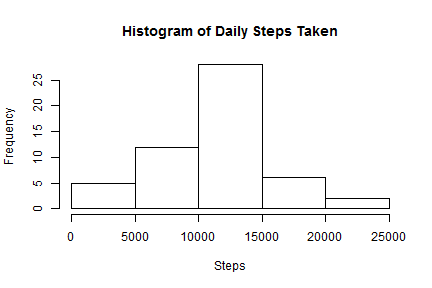
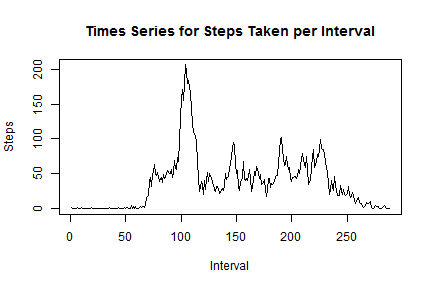
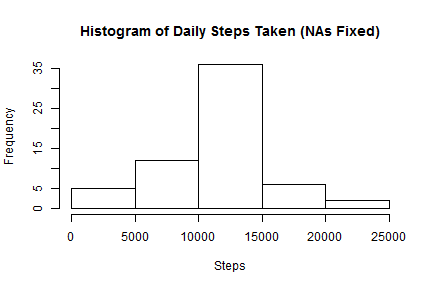
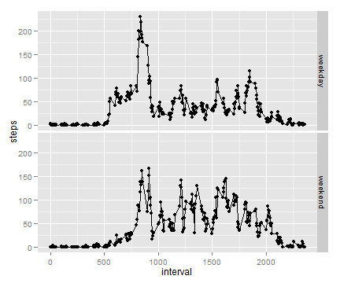

## Loading and preprocessing the data

```r
library(dplyr)
library(knitr)
library(plyr)
library(tidyr)
library(data.table)
library(lubridate)
library(timeDate)
library(ggplot2)

newfolder="C:/Users/Brian/Documents/GitHub/RepData_PeerAssessment1"
setwd(newfolder)

A<-read.csv("activity.csv")
```

## What is mean total number of steps taken per day?
Calculate sums for each day and make a histogram of the resulting data.

```r
sumA<-ddply(A,~date,summarise,sum=sum(steps))
head(sumA)
```

```
##         date   sum
## 1 2012-10-01    NA
## 2 2012-10-02   126
## 3 2012-10-03 11352
## 4 2012-10-04 12116
## 5 2012-10-05 13294
## 6 2012-10-06 15420
```


```r
hist(sumA[,2], main="Histogram of Daily Steps Taken", xlab="Steps")
```

 

## What is the average daily activity pattern?

Calculate the mean and median per day removing NA values

```r
meanA<-mean(sumA[,2], na.rm=TRUE)
medianA<-median(sumA[,2], na.rm=TRUE)
meanA
```

```
## [1] 10766.19
```

```r
medianA
```

```
## [1] 10765
```

Calculate mean steps taken per 5-minute interval, removing NA values

```r
meanInt<-ddply(A,~interval,summarise,mean=mean(steps, na.rm=TRUE))
```
Plot the time series of average steps taken per interval

```r
plot(meanInt[,2], type="l", main="Times Series for Steps Taken per Interval", ylab="Steps",xlab="Interval")
```

 

Determine which interval contains the max steps

```r
meanInt[which.max(meanInt[,2]),]
```

```
##     interval     mean
## 104      835 206.1698
```
Calculate  number of NA values in the data

```r
sum(is.na(A))
```

```
## [1] 2304
```

## Imputing missing values
Replace NA values with corresponding mean for that interval

```r
datavect<-rep(meanInt[,2],61)*is.na(A[,1])
newcol<-A[,1]
newcol[is.na(newcol)]<-0
fixedcol<-datavect+newcol
A2<-A
A2[,1]<-fixedcol
head(A2)
```

```
##       steps       date interval
## 1 1.7169811 2012-10-01        0
## 2 0.3396226 2012-10-01        5
## 3 0.1320755 2012-10-01       10
## 4 0.1509434 2012-10-01       15
## 5 0.0754717 2012-10-01       20
## 6 2.0943396 2012-10-01       25
```

Get new sums per day with fixed NA values

```r
sumA2<-ddply(A2,~date,summarise,sum=sum(steps))
```

```r
hist(sumA2[,2], main="Histogram of Daily Steps Taken (NAs Fixed)", xlab="Steps")
```

 

Calculate the mean and median per day with fixed NA values

```r
meanA2<-mean(sumA2[,2], na.rm=TRUE)
medianA2<-median(sumA2[,2], na.rm=TRUE)
meanA2
```

```
## [1] 10766.19
```

```r
medianA2
```

```
## [1] 10766.19
```

The new mean and median do not differ much since I input all tha NA values with their respective interval means.  I imagine if I supplied the daily means or medians the result would have been very dramatic.

## Are there differences in activity patterns between weekdays and weekends?
After some processing we will produce a panel plot to compare differences in weekday and weekend activity.

Transform the date column into appropriate Date format and append a new column onto the data frame.

```r
A2[,2]<-as.character(A2[,2])
A2[,2]<-ymd(A2[,2])
daycol<-seq(1,length(A[,2]))
A2<-cbind(A2,daycol)
```

Assign correct value (weekday or weekend) to days in the new column

```r
for (i in 1:length(A2[,2])) {
if(isWeekday(A2[i,2])==TRUE) A2[i,4]<-"weekday" else A2[i,4]<-"weekend"
}
```

Convert the new column into factors, then group the dataset by interval and weekday/weekend and take the average number of steps for each subset.

```r
A2[,4]<-as.factor(A2[,4])
group_A2<-group_by(A2,interval,daycol)
meanGroup<-summarise_each(group_A2,funs(mean),steps)
```

Create a time series panel plot of steps per interval for both weekdays and weekends.

```r
qplot(interval,  steps,  data  =  meanGroup,  facets  = daycol~.) +
        geom_line()
```

 

At first glance it appears that the plots are largely similar. However, it appears that the subject sleeps in and stays up later on the weekend and has more physical activity throughout the day.


